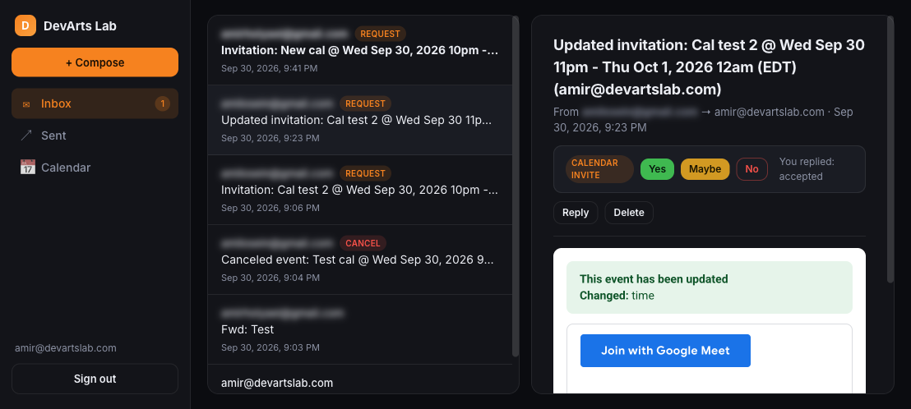
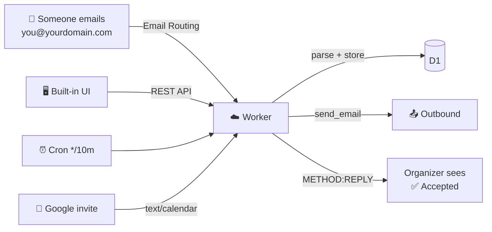

<div align="center">

# 📮 devarts-mail

**Self-hosted email + calendar — entirely on Cloudflare.**
No Google. No iCloud. No third-party mail service.

[](https://github.com/DevArtsLab/devarts-mail/actions/workflows/deploy.yml)
[](https://workers.cloudflare.com/)
[](https://developers.cloudflare.com/d1/)
[](LICENSE)

</div>

---

## ✨ What it does

|                             |                                                                                                                                    |
| --------------------------- | ---------------------------------------------------------------------------------------------------------------------------------- |
| 📥 **Inbound email**        | Email Routing → Worker `email()` handler → parsed & stored in D1                                                                   |
| 📤 **Outbound email**       | Send real mail as `you@yourdomain.com` via the `send_email` binding                                                                |
| 📅 **Calendar invites**     | Parses `text/calendar`, RSVP **Yes / Maybe / No** sends a real iCal `METHOD:REPLY` — organizers see `you@yourdomain.com: Accepted` |
| 🗓️ **Independent calendar** | Create/edit/delete events in your own calendar, send `REQUEST`/`CANCEL` invites, import `.ics` anywhere                            |
| ⏰ **Reminders**            | Cron trigger emails you before events                                                                                              |
| 🔐 **Auth**                 | Password login, HMAC-signed session cookie                                                                                         |
| 🖥️ **UI**                   | Minimal dark interface — Inbox, Sent, Compose, Month-view Calendar                                                                 |





## 🚀 One-command install

```bash
git clone https://github.com/DevArtsLab/devarts-mail.git
cd devarts-mail
./install.sh
```

That's it. The installer:

1. `npm install`
2. generates `.dev.vars` with strong random secrets (and **prints your UI password**)
3. runs `wrangler login` if needed (browser OAuth — that's the only interaction)
4. provisions **D1**, runs **migrations**, uploads **secrets**, **deploys**, and creates the **Email Routing rule** `you@domain → worker`

## ⚙️ Unified config — one file

Everything lives in **`wrangler.jsonc`** — worker, assets, D1, `send_email`, cron, routes, and all app variables:

| Var                       | Default               | Meaning                                  |
| ------------------------- | --------------------- | ---------------------------------------- |
| `MAIL_DOMAIN`             | `devartslab.com`      | Your domain                              |
| `PRIMARY_ADDRESS`         | `amir@devartslab.com` | Send/receive identity                    |
| `DISPLAY_NAME`            | `Amir \| DevArts Lab` | From-name on outgoing mail               |
| `AUTO_ACCEPT_INVITES`     | `"false"`             | Auto-accept incoming invites             |
| `INVITE_REMINDER_MINUTES` | `"30"`                | Reminder email before events (`0` = off) |
| `SESSION_TTL_HOURS`       | `"168"`               | UI session length                        |

Secrets live in `.dev.vars` locally / `wrangler secret` in prod — never committed.

## 📁 Layout

```
├── wrangler.jsonc      # ← THE unified config
├── install.sh          # one-command setup
├── migrations/         # D1 schema
├── scripts/setup.mjs   # provisioning engine (idempotent)
├── src/
│   ├── index.ts        # entry: fetch + email + scheduled
│   ├── inbound.ts      # inbound parse → store → RSVP side-effects
│   ├── mail.ts         # postal-mime in / mimetext + send_email out
│   ├── ical.ts         # RFC 5545 iCal parser + generator
│   ├── api.ts          # REST API for the UI
│   ├── auth.ts         # cookie session auth
│   ├── edge.ts         # optional hostname routing (extra subdomains)
│   └── db.ts           # D1 access layer
├── public/             # the UI (served via Workers Assets)
└── test/               # vitest unit tests
```

## 🧪 Commands

```bash
npm run dev              # local dev server
npm test                 # unit tests
npm run typecheck        # TypeScript check
npm run deploy           # deploy
npm run setup            # full re-provisioning (idempotent)
npm run migrate:remote   # apply D1 migrations
```

Push to `main` auto-deploys via GitHub Actions (set repo secrets
`CLOUDFLARE_API_TOKEN` + `CLOUDFLARE_ACCOUNT_ID`).

## 🔁 Reuse on your own domain

1. Clone → `./install.sh` after editing `wrangler.jsonc` `vars`
   (`MAIL_DOMAIN`, `PRIMARY_ADDRESS`, `DISPLAY_NAME`, `D1_DATABASE_NAME`)
2. Done — your mail + calendar runs on Cloudflare, data stays in your D1.

## 📬 Notes

- Replies to calendar invites are real RFC 5546 `METHOD:REPLY` emails with
  `In-Reply-To` threading — Gmail/Google Calendar records your status.
- Email Sending requires the `cf-bounce` DNS records on your domain —
  don't delete them.
- Full calendar export: `GET /api/calendar.ics`.

---

<div align="center">
Built on Cloudflare Workers · D1 · Email Routing · Email Sending
</div>
